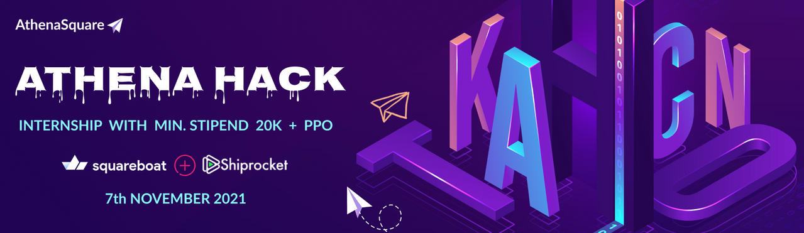

  
  
    
    
# Shopmart
    E-Commerce Site for Online Shopping

    AthenaHack 2021    

    Made with ❤ by Team KitKat

 
     

https://shopmart-client.netlify.app  -- Checkout the application

 

 | Stack      | MERN  |
| ------------- |:-------------:| 
|  Team Strength     | 4 |

 

## Features !

-   User Friendly UI
-   Valid for Multiple Stores / Users

-   Dashboard for Administrators
-   Flexible Payments System

-   Easy Orders, dispatch, and refunds
-   Caching and Customer Support

-   Toxic Review detection.
-   Uses blockchain for image storage by IPFS 

  

[Watch Project presentation Here](https://www.canva.com/design/DAEu8M3gsQI/_mtEqhgKvSK98pftuYNl7Q/view?utm_content=DAEu8M3gsQI&utm_campaign=designshare&utm_medium=link&utm_source=sharebutton)

 

[Watch Project Demo Video Here](https://drive.google.com/file/d/1vBUJ7X18U-anWGFm2Qk-jU1KA304XHic/view?usp=sharing)

 

Thanks to orgainser of the AthenaHack.

Looking forward for more of such events !

Regards,

[Saheb Kumar](https://www.linkedin.com/in/sahebcse/)

